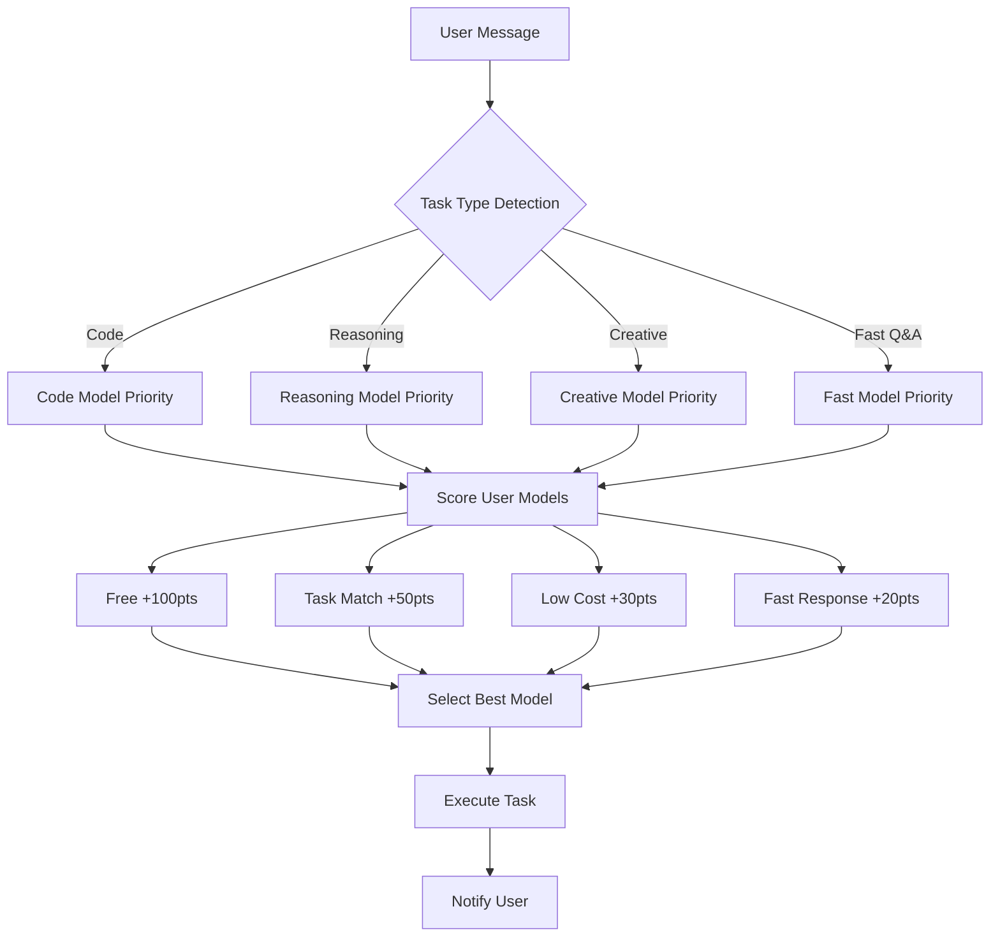

# model-router 🔄

**Smart Model Router for OpenClaw** - Automatically routes tasks to optimal models based on type, cost, and speed.

**智能模型路由器** - 根据任务类型、成本和速度自动路由到最优模型。

---

## 🌟 Features | 特性

| English | 中文 |
|---------|------|
| ✅ Auto-register hook on install | ✅ 安装后自动注册 Hook |
| ✅ Smart task type detection | ✅ 智能任务类型检测 |
| ✅ Prioritizes free/low-cost models | ✅ 优先使用免费/低消耗模型 |
| ✅ Model switch notifications | ✅ 模型切换提示 |
| ✅ Universal compatibility | ✅ 通用兼容性 |
| ✅ No configuration needed | ✅ 无需配置 |

---

## 🚀 Quick Start | 快速开始

### Installation | 安装

```bash
# Install from ClawHub | 从 ClawHub 安装
npx clawhub@latest install model-router

# Or install locally | 或本地安装
openclaw hooks install /path/to/model-router
```

### Usage | 使用

**Auto-routing (no tags needed) | 自动路由（无需标签）：**

```
帮我写个 Python 脚本
→ [model-router] 为您智能匹配 step-3.5-flash 模型为您执行该需求

分析一下这个复杂问题
→ [model-router] 为您智能匹配 glm-4.7 模型为您执行该需求
```

**Manual override | 手动指定：**

```
[model: bailian/qwen3-coder-plus] 帮我重构这段代码
```

---

## 🎯 How It Works | 工作原理



---

## 📊 Model Scoring | 模型打分

| Factor | 因素 | Score | 分数 |
|--------|------|-------|------|
| Free model | 免费模型 | +100 | ✅ |
| Task match | 任务匹配 | +50 | ✅ |
| Zero cost | 零成本 | +30 | ✅ |
| Low cost | 低成本 | +20 | ✅ |
| Fast response | 快速响应 | +20 | ✅ |
| Optimal context | 适中上下文 | +10 | ✅ |

---

## 📋 Task Detection | 任务检测

### Code | 代码
**Keywords | 关键词：**
- CN: 代码，编程，脚本，函数，调试，bug，重构
- EN: code, coding, script, function, debug, refactor, python, javascript

### Reasoning | 推理
**Keywords | 关键词：**
- CN: 分析，推理，逻辑，为什么，复杂，深度，解释
- EN: analyze, reasoning, logic, why, complex, explain, principle

### Creative | 创作
**Keywords | 关键词：**
- CN: 写，创作，故事，文案，文章，邮件，总结
- EN: write, create, story, article, email, summary, translate

### Fast Q&A | 快速问答
**Keywords | 关键词：**
- CN: 简单，快速，是什么，多少，定义，意思
- EN: simple, quick, what is, how many, definition, meaning

---

## 🔧 Configuration | 配置

**No configuration needed!** 无需配置！

The hook automatically:
- Reads your `openclaw.json` model list
- Scores models based on cost, speed, and task match
- Selects the best model for each task

Hook 自动：
- 读取 `openclaw.json` 中的模型列表
- 根据成本、速度、任务匹配度打分
- 为每个任务选择最优模型

---

## 📝 Examples | 示例

### Example 1: Code Task | 代码任务

```
User: 帮我写个 Python 脚本，批量处理文件

[model-router] 任务类型：code
[model-router] 为您智能匹配 step-3.5-flash 模型为您执行该需求
```

### Example 2: Complex Reasoning | 复杂推理

```
User: 分析一下这个电商数据的异常波动原因

[model-router] 任务类型：reasoning
[model-router] 为您智能匹配 glm-4.7 模型为您执行该需求
```

### Example 3: Model Switch | 模型切换

```
(Previous task: complex reasoning → glm-4.7)

User: 今天天气怎么样

[model-router] 任务类型：fast
[model-router] 已恢复默认模型 step-3.5-flash，请放心使用
```

---

## 🛠️ Development | 开发

### Project Structure | 项目结构

```
model-router/
├── handler.js          # Hook handler | Hook 处理器
├── package.json        # Package config | 包配置
├── HOOK.md            # Hook documentation | Hook 文档
├── README.md          # This file | 本文件
├── SKILL.md           # Skill documentation | 技能文档
└── test.js            # Test suite | 测试套件
```

### Testing | 测试

```bash
# Run tests | 运行测试
npm test

# Or directly | 或直接
node test.js
```

### Debugging | 调试

```bash
# View logs | 查看日志
tail -f ~/.openclaw/logs/gateway.log | grep model-router

# Check hook status | 检查 Hook 状态
openclaw hooks list
```

---

## 📦 Publishing | 发布

### To ClawHub | 发布到 ClawHub

```bash
# Install clawhub CLI | 安装 clawhub CLI
npm install -g clawhub

# Login | 登录
clawhub login

# Publish | 发布
clawhub publish
```

### To GitHub | 发布到 GitHub

```bash
# Initialize git | 初始化 git
git init
git add .
git commit -m "Initial release: model-router v1.0.0"

# Add remote | 添加远程仓库
git remote add origin https://github.com/ra1nzzz/model-router.git

# Push | 推送
git push -u origin main
```

---

## 🤝 Contributing | 贡献

Contributions welcome! 欢迎贡献！

1. Fork the repo | Fork 仓库
2. Create a branch | 创建分支
3. Make changes | 修改代码
4. Test thoroughly | 充分测试
5. Submit PR | 提交 PR

---

## 📄 License | 许可证

MIT License - See [LICENSE](LICENSE) file for details.

---

## 👤 Author | 作者

**韬哥**

- GitHub: [@ra1nzzz](https://github.com/ra1nzzz)
- Blog: Coming soon

---

## 🙏 Acknowledgments | 致谢

- OpenClaw team for the amazing framework
- Community for feedback and testing

---

**Last updated:** 2026-03-08  
**Version:** 1.0.0  
**Status:** ✅ Production Ready

---

<div align="center">

**⭐ Star this repo if you find it useful! ⭐**

**觉得有用请给个星标！⭐**

</div>
